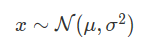
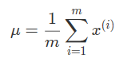
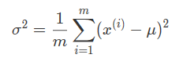

# Anomaly Detection
  
**Problem Motivation**
  
Just like in other learning problems, we are given a dataset x(1), x(2), x(3),..... x(m).
We are then given a new example, xtest, and we want to know whether this new example is abnormal/anomalous.  
We define a "model" p(x) that tells us the probability the example is not anomalous. We also use a threshold ϵ (epsilon) as a dividing line so we can say which examples are anomalous and which are not.  
A very common application of anomaly detection is detecting fraud:  
  
->  xi = features of user i's activities.  
->  Model p(x) from the data.  
->  Identify unusual users by checking which have p(x)<ϵ.  
  
If our anomaly detector is flagging too many anomalous examples, then we need to decrease our threshold ϵ

**Gaussian Distribution**
  
The Gaussian Distribution is a familiar bell-shaped curve that can be described by a function  N(μ,σ2).  
Let x belongs to R. If the probability distribution of x is Gaussian with mean μ, variance σ2, then :  

  
The little ∼ or 'tilde' can be read as "distributed as."  
The Gaussian Distribution is parameterized by a mean and a variance.  
Mu, or μ, describes the center of the curve, called the mean. The width of the curve is described by sigma, or σ, called the standard deviation.  
The full function is as follows:  

  
We can estimate the parameter μ from a given dataset by simply taking the average of all the examples:  

  
We can estimate the other parameter,σ2   

  

